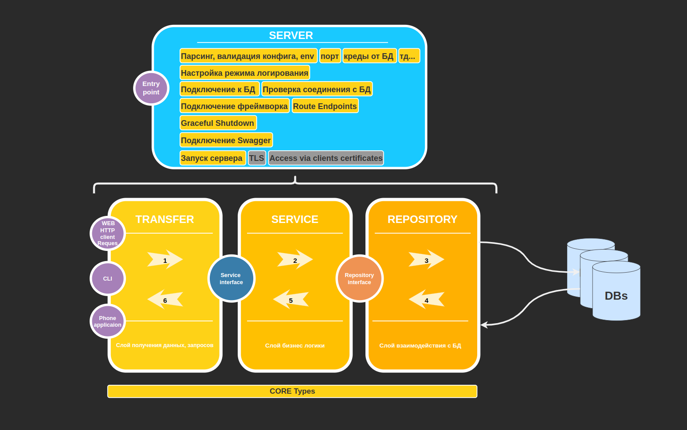
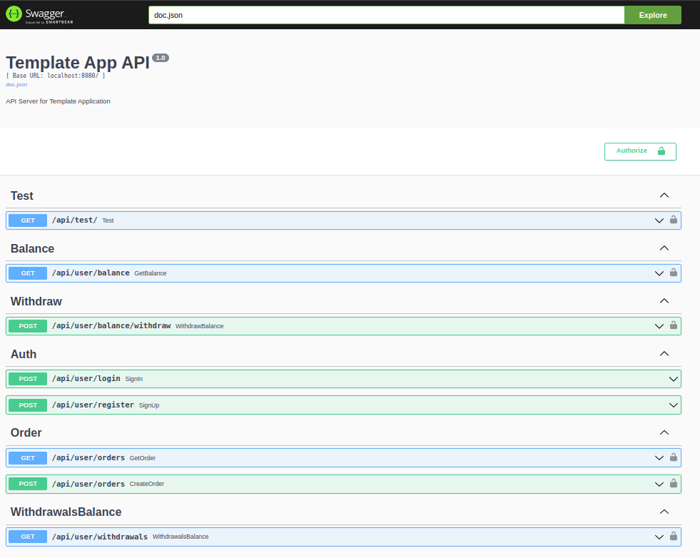

# gopherMart

Индивидуальный дипломный проект курса «Go-разработчик»

### **Спецификация проекта**
- see [here](./SPECIFICATION.md)

## **Общая схема Микросервиса** 

## **Реализованные REST API endpoints в**

